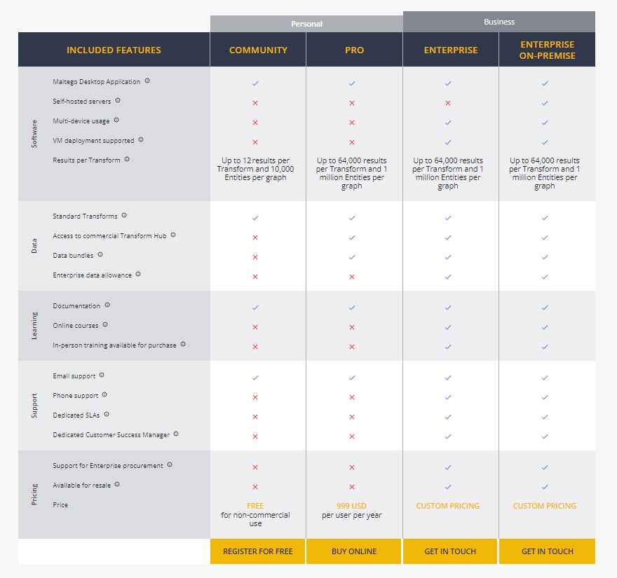
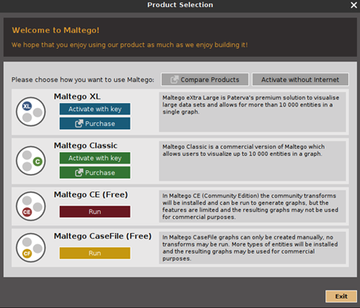
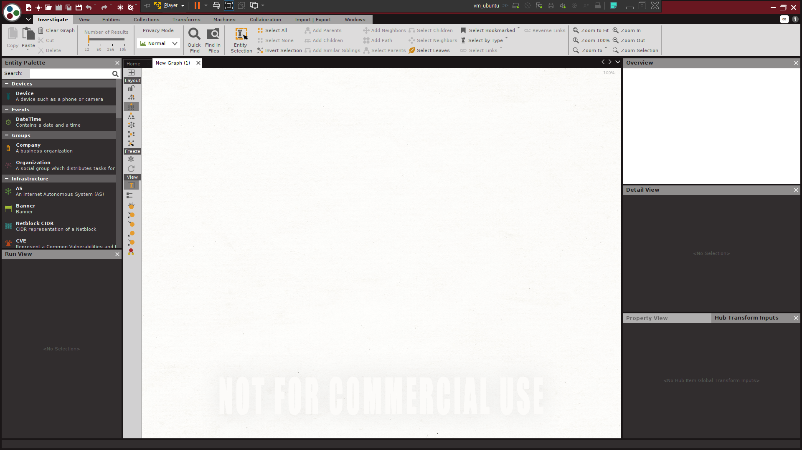

# maltego_study

- 목적:  maltego에 대한 이해와 사용 방법에 대해서 정리한다.

# maltego란?

 - paterva사가 개발한 OSINT 도구.
 - 조사에 핑요한 다양한 OSINT를 수집하여 정보간 연관성을 분석.
 - 수집되는 정보는 주로 이룸, 이메일, 조직 구조, 도메인, 문서 등이며 수집된 정보 간의 관계를 찾기 위해 방향 그래프를 활용한다. 
 - maltego는 온라인상에 파편화되어있는 데이터들을 가시적으로 보여주는 도구

# maltego 가격 정책
maltego는 그래프로 만드는 데이터의 수,  멀티 디바이스, 등의 카테고리로 가격을 정하고 있다. 이에 대한 사진은 다음과 같다.

위 사진에서 볼 수 있듯이, 제한적으로 무료 버전을 사용할 수 있다. 

# maltego Install

내가 공부하는 환경은 다음과 같다. 

 - ubuntu 18.04

우분투, 맥, 윈도우 환경에서 maltego를 사용하기 위해서는 먼저 회원가입을 해야한다. 무료 회원가입은 [maltego 공식사이트](https://www.maltego.com/)에서 PRODUCTS>Register for Free를 누르면 회원가입을 할 수 있다. 

회원가입에는 이메일, 이름, 비밀번호만 설정하면 된다. 

이와 같이 회원가입을 하면 자신의 os에 맞는 파일을 다운받은 후 이를 실행하면 된다. 

실행하면 위와 같은 화면이 나오는데 나는 무료버전을 사용할 것으로 Maltego CE(Free)를 선택한다. 그 후 로그인을 하면 maltego를 사용할 수 있다.

만약 칼리 리눅스를 사용한다면 기본으로 설치되어있다. 

# tutorial 

 - [톰크루즈](https://mrrootable.tistory.com/109?category=709666)